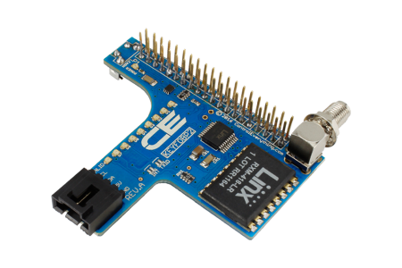

[](https://www.controleverything.com/content/Key-Fob?sku=KEYFOBP2)
# KEYFOBP2
KEYFOBP2 Receiver and I²C Expansion Port.

The KEYFOBP2 device is capable of receiving button presses from a remote control up to 750 feet away.

This Device is available from ControlEverything.com [SKU: KEYFOBP2]

https://www.controleverything.com/content/Key-Fob?sku=KEYFOBP2

This Sample code can be used with Raspberry pi

## Java
Download and install pi4j library on Raspberry pi. Steps to install pi4j are provided at:

http://pi4j.com/install.html

Download (or git pull) the code in pi.

Compile the java program.
```cpp
$> pi4j KEYFOBP2.java
```

Run the java program.
```cpp
$> pi4j KEYFOBP2
```

## Python
Download and install smbus library on Raspberry pi. Steps to install smbus are provided at:

https://pypi.python.org/pypi/smbus-cffi/0.5.1

Download (or git pull) the code in pi. Run the program.

```cpp
$> python KEYFOBP2.py
```

#####The code output is the operation performed by respective KEYFOBP2 button.
